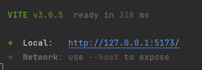

# Pi Hot! Meme Printer

It's a silly over-engineered thing that lets people send images to a WhatsApp bot, prints them on a Thermal Printer and
shows the lovely creations on a front end.

This isn't a complete guide on setting everything up as there is a ton of faff with the PI, WhatsApp/meta accounts that
is covered in the links. This just demonstrates what I was able to get working and how I did certain things should
someone want to do something similar.

## Why though?

Why not?

I knew AWS/Serverless and I wanted to play with AWS CDK and learn about it, I had a spare PI Zero W, and I was bored.

I happened upon this link https://learn.adafruit.com/pi-thermal-printer?view=all and thought it sounded like fun, but it
wasn't interesting or silly enough for me, it needed something else.

## Right...but...how?

With much learning and failure. Mostly relating to CDK, learning refactoring, improving, wondering why it doesn't work
anymore.

Simply put it does the following:

* WhatsApp bot gets a message
* WhatApp bot calls `POST /webhooks`
* The webhook endpoint strips out the media_id from that message and uses that ID to get the binary image data for the
  image. Then it uploads this image to the raw-memes bucket.
* An event handler listens for PutObject events on that bucket and processed the image down to a small jpg before
  uploading it to 'processed-memes', deleting the source it and creating a DynamoDb record for the item and storing the
  image as base64.
* The RaspberryPi polls the processed bucket for new files, when found, it prints the image on the AdaFruit Thermal
  Printer, take a picture with the camera of said printed image then uploads that image to the `meme-camera-pics`
  bucket.
* An event handler listens for PutObject events on that camera bucket and converts them to base65 and updates the
  DynamoDb record so that is now has 2 base 64 images associated with it.
* The front end calls GET /memes which lists all the DynamoDb entries and renders them for everyone to marvel at.
  Clicking each item shows the printed image.

## Architecture

TBD

## Local Development

### Running in localstack

Set up localstack on your system per https://github.com/localstack/localstack

#### Useful commands

* `npm run build`   compile typescript to js
* `npm run watch`   watch for changes and compile
* `npm run test`    perform the jest unit tests
* `cdk deploy`      deploy this stack to your default AWS account/region
* `cdk diff`        compare deployed stack with current state
* `cdk synth`       emits the synthesized CloudFormation template

#### Deps

* Docker
* npm install -g aws-cdk-local aws-cdk
* pip install awscli-local

Then set up CDK-local, so you can deploy your stuff into it.

```
npm install -g aws-cdk-local aws-cdk
cdklocal bootstrap
cdklocal synth
cdklocal deploy
```

### Back End

Assuming you have initialised localstack and ran `cdklocal bootstrap` and deployed the stack you are testing
with `cdk local deploy [STACK_NAME]`

```shell
curl --request GET \
--url https://[SOMETHING].execute-api.localhost.localstack.cloud:4566/prod/
```

Note that, when developing against a localstack back end api you will need to update the `VITE_SERVICE_HOST` and
the `VITE_API_KEY` values in the `/front-end/.env` file with the values generated from the localstack output

### Front End

```shell
cd front-end
yarn install
or
npm install

yarn dev
or 
npm run dev
```

After running the following commands you will see this in your terminal.



Click the link to view your application in the browser.

## Deployment

### Front End

Run the following build command in the `front-end` directory to generate the `/dist` files.

```shell
yarn build
```

When you run `cdk deploy FrontEndStack`, it will upload these files to S3

### Infra CDK

```shell
assuming aws cli is configured

cdk boostrap 
cdk synth [STACK_NAME]
for example 
cdk synth ImageEventHandlerStack

cdk deploy [STACK_NAME]
```

Be sure to do the SharedStack first as this one creates alot of required dependencies of the other stacks.

## Manual Steps (things I haven't automated)

Domain name creation - Register it yourself!

Create a us-east-1 cert for the Cloud Front distribution as this is required to be in said zone. Copy the arn for this
into the `/infra/.env file` as `CLOUDFRONT_US_EAST_1_CERTIFICATE_ARN`

Create a cert in your default location for other services and copy the arn for this
into the `/infra/.env file` as `DEFAULT_REGION_CERTIFICATE_ARN`. This was done manually as DNS validation of the hosted
zone would not work for me, so I had to do it via email.

Mapping of the subdomain to the API Gateway AWS endpoint (this just seems to fail when I
try it)

## Raspberry PI things (I suck at Python dot com)

Don't judge me, the Python is cobbled together and is not my forté.

For the most part I followed this guide https://learn.adafruit.com/pi-thermal-printer?view=all#raspberry-pi-os-setup

The changes needed to run this are mostly to do with the camera and aws.

```shell
pip install boto3
pip install libatlas3-base
pip install pillow
```

For the Web cam -> https://singleboardblog.com/install-python-opencv-on-raspberry-pi/

```shell
Webcam install
pip install --upgrade pip setuptools wheel
sudo apt-get install -y libhdf5-dev libhdf5-serial-dev python3-pyqt5 libatlas-base-dev libjasper-dev
pip install opencv-contrib-python==4.5.3.56
pip3 install opencv-python
```

I'm sure some of these gave me grief so google is your friend if you encounter problems too!

To run the script

```shell
cd /pi-python
python main.py
```

For best results run it as a service.

## Gotchas

### Front End

Some libraries don't build well with esbuild such as https://github.com/onurzorluer/react-image-file-resizer which i
initially used to resize the image right to the processed bucket to take the load off the server.

### Hosting

per -> https://docs.aws.amazon.com/Route53/latest/DeveloperGuide/domain-replace-hosted-zone.html

When you create a hosted zone, Route 53 assigns a set of four name servers to the hosted zone. If you delete a hosted
zone and then create a new one, Route 53 assigns another set of four name servers. Typically, none of the name servers
for the new hosted zone match any of the name servers for the previous hosted zone. If you don't update the domain
configuration to use the name servers for the new hosted zone, the domain will remain unavailable on the internet.

This means that, when you create the shared stack, you will need to update the name servers for your registered domain
with the ones it assigned then wait for the changes to propagate around the internet. Pretty annoying.

### Python/PI

Don't access the printer in 2 different threads or bad things happen...
